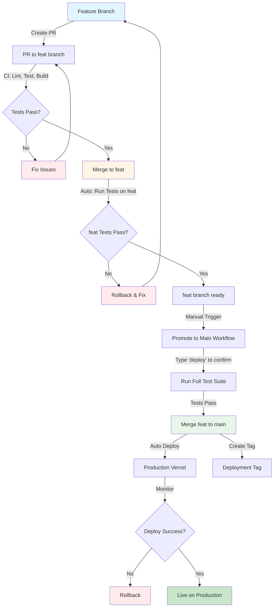

# CI/CD Workflow Diagram



## Branch Strategy

### 1. Feature Development Flow
```
developer → feature-branch → PR → feat → tests → ready for production
```

### 2. Production Deployment Flow
```
feat (tested) → manual promotion → main → auto-deploy → production
```

## CI/CD Stages

### Stage 1: Pull Request (to feat)
- **Trigger**: PR opened/updated targeting `feat`
- **Actions**:
  - Install dependencies
  - Run linter
  - Run tests
  - Build project
  - Upload artifacts
- **Required**: All checks must pass

### Stage 2: Merge to Feat
- **Trigger**: PR merged to `feat`
- **Actions**:
  - Re-run tests on `feat` branch
  - Verify build
  - Comment on PR with status
- **Purpose**: Ensure integration works

### Stage 3: Promote to Main (Manual)
- **Trigger**: Manual workflow dispatch
- **Input Required**: Type "deploy" to confirm
- **Actions**:
  - Run full test suite
  - Build for production
  - Merge `feat` to `main`
  - Create deployment tag
- **Safety**: Requires explicit confirmation

### Stage 4: Deploy to Production
- **Trigger**: Push to `main`
- **Actions**:
  - Build production bundle
  - Deploy to Vercel
  - Update live site
- **Automated**: No manual intervention

## Protection Rules

### Main Branch
- ✅ Require PR for all changes
- ✅ Require 1+ approvals
- ✅ Require passing status checks
- ✅ No force pushes
- ✅ No deletions
- ⚠️ Only updated via promotion from `feat`

### Feat Branch
- ✅ Require PR for all changes
- ✅ Require passing status checks
- ✅ No force pushes
- ✅ Auto-run tests on merge

### Feature Branches
- ✅ Free development
- ✅ Must pass CI to merge
- ✅ Target `feat` branch

## Deployment Security

1. **Secrets Management**: All tokens stored in GitHub Secrets
2. **Manual Confirmation**: Production deployment requires explicit approval
3. **Rollback Ready**: Tagged deployments for easy rollback
4. **Test Coverage**: Multiple test stages before production
5. **Build Verification**: Separate build checks

## Monitoring Points

- [ ] PR checks status
- [ ] Feat branch test results
- [ ] Production deployment status
- [ ] Vercel deployment logs
- [ ] Build size tracking

## Emergency Procedures

### Hotfix Process
1. Create hotfix branch from `main`
2. Make fix
3. Open PR directly to `main` (with admin override)
4. Merge and deploy
5. Backport to `feat` and feature branches

### Rollback Process
1. Identify last working deployment tag
2. Revert `main` to that tag
3. Force push triggers new deployment
4. Fix issue in `feat` branch
5. Re-promote when fixed

## Best Practices

1. **Small PRs**: Keep changes focused and reviewable
2. **Test Locally**: Run `npm test` before pushing
3. **Build Check**: Run `npm run build` to verify
4. **Clear Commits**: Write descriptive commit messages
5. **Review Artifacts**: Check uploaded build artifacts
6. **Monitor Deployments**: Watch Actions tab during deployments
